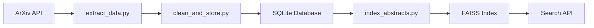

# 🔬 ArXiv Research Hub

<div align="center">


**A modern, AI-powered research paper discovery platform that revolutionizes how researchers explore scientific literature.**

[🚀 Live Demo](#) • [📖 Documentation](#setup) • [🤝 Contributing](#contributing) • [🐛 Report Bug](../../issues)

</div>

---

## ✨ Features

### 🤖 **AI-Powered Intelligence**
- **Smart Query Understanding**: Natural language processing interprets research queries intelligently
- **Semantic Search**: FAISS-powered vector search finds papers by meaning, not just keywords
- **Dual Search Modes**: Choose between AI-assisted or manual search approaches

### 🎨 **Modern User Experience**
- **Beautiful Interface**: Clean, responsive design with smooth animations
- **Dark/Light Themes**: Seamless theme switching with persistent preferences
- **Interactive Components**: Hover effects, loading states, and micro-interactions
- **Mobile Optimized**: Works perfectly on desktop, tablet, and mobile devices

### 🔍 **Advanced Search Capabilities**
- **Multi-Filter Search**: Filter by year, category, author, title, and abstract
- **Smart Result Limiting**: Specify result count in natural language (e.g., "find me 10 papers")
- **Real-Time Results**: Lightning-fast search through 4,000+ research papers
- **Export Functionality**: Download search results as JSON for further analysis
- **Search History**: Persistent search results with localStorage integration

### 📊 **Rich Data Visualization**
- **Interactive Statistics**: Visual insights into the research database
- **Publication Trends**: Charts showing papers by year and category
- **Author Analytics**: Discover prolific researchers in your field

---

## 🏗️ Architecture

```
📦 ArXiv Research Hub
├── 🖥️  backend/                 # FastAPI REST API
│   ├── 🛣️  api/                # Route handlers
│   ├── 🔧 core/               # Database & utilities
│   ├── 📋 models/             # Pydantic schemas
│   └── ⚙️  services/           # Business logic
├── 🎨 frontend/               # React TypeScript SPA
│   ├── 🧩 components/         # Reusable UI components
│   ├── 🌐 services/           # API integration
│   └── 📝 types/              # TypeScript definitions
└── 💾 data/                   # Organized data storage
    ├── 🗄️  database/          # SQLite database
    ├── 🔍 indexes/            # FAISS search indexes
    └── 📜 scripts/            # Data processing tools
```

---

## 🚀 Quick Start

### Prerequisites

- **Python 3.8+** with pip
- **Node.js 16+** with npm
- **Git** for version control

### 🔧 Installation

1. **Clone the repository**
   ```bash
   git clone https://github.com/yourusername/arxiv-research-hub.git
   cd arxiv-research-hub
   ```

2. **Set up environment variables**
   ```bash
   # Create .env file in backend directory
   cd backend
   echo "TOGETHER_API_KEY=your_api_key_here" > .env
   echo "FRONTEND_URL=http://localhost:3000" >> .env
   cd ..
   ```

3. **Install all dependencies**
   ```bash
   npm run setup
   ```

4. **Start the development servers**
   
   **Option A: Manual (Recommended)**
   ```bash
   # Terminal 1 - Backend
   cd backend && python start.py
   
   # Terminal 2 - Frontend  
   cd frontend && npm start
   ```
   
   **Option B: Using batch script (Windows)**
   ```bash
   start-dev.bat
   ```

5. **Access the application**
   - 🌐 **Frontend**: http://localhost:3000
   - 🔌 **Backend API**: http://localhost:8000
   - 📚 **API Documentation**: http://localhost:8000/docs

---

## 📊 Data Pipeline

The platform includes a complete data processing pipeline:

### 🔄 **Data Processing Workflow**



1. **📥 Data Extraction** (`extract_data.py`)
   - Fetches papers from ArXiv API
   - Supports multiple categories and date ranges
   - Handles rate limiting and error recovery

2. **🧹 Data Cleaning** (`clean_and_store.py`)
   - Normalizes paper metadata
   - Stores in structured SQLite database
   - Creates author and category relationships

3. **🔍 Vector Indexing** (`index_abstracts.py`)
   - Generates embeddings using SentenceTransformers
   - Creates FAISS index for semantic search
   - Optimizes for fast similarity queries

---

## 🎨 UI Showcase

### 🏠 **Welcome Page**
- Animated particle background
- Feature showcase with gradient cards
- Smooth page transitions
- Call-to-action buttons

### 🔍 **Search Interface**
- Dual-mode search (AI/Manual)
- Advanced filtering sidebar
- Real-time result updates
- Export functionality

### 📄 **Article Cards**
- Clean, readable layout
- Hover animations
- Category tags
- Author and date information

### ⚙️ **Settings Panel**
- Theme switching
- Search preferences
- Display customization
- Data export options

---

## 🔒 Security Features

- **Environment Variables**: Sensitive credentials stored securely in .env files
- **Input Validation**: Comprehensive validation for all user inputs and API requests
- **XSS Prevention**: Sanitized localStorage data and API responses
- **Error Sanitization**: Generic error messages to prevent information disclosure
- **Bounds Checking**: FAISS index validation to prevent crashes
- **Dependency Security**: Regular updates with npm security overrides

---

## 🛠️ Technology Stack

### **Backend**
- **FastAPI** - Modern, fast web framework
- **SQLite** - Lightweight database
- **FAISS** - Vector similarity search
- **SentenceTransformers** - Text embeddings
- **Pydantic** - Data validation

### **Frontend**
- **React 18** - UI framework
- **TypeScript** - Type safety
- **Framer Motion** - Smooth animations
- **Lucide React** - Beautiful icons
- **Axios** - HTTP client

### **Data Processing**
- **Pandas** - Data manipulation
- **NumPy** - Numerical computing
- **ArXiv API** - Paper metadata
- **Logging** - Process monitoring

---

## 🔌 API Reference

### **Search Endpoints**

```http
POST /api/v1/search
Content-Type: application/json

{
  "query": "neural networks",
  "search_type": "ai",
  "limit": 10,
  "year_filter": "2023",
  "category_filter": "cs.AI"
}
```

### **Statistics Endpoints**

```http
GET /api/v1/stats
GET /api/v1/years
```

### **Response Format**

```json
{
  "articles": [...],
  "total_count": 42,
  "search_type": "ai",
  "explanation": "AI interpretation of your query"
}
```

---

## 🚀 Deployment

### **Production Build**

```bash
# Build frontend
cd frontend && npm run build

# Start backend
cd backend && uvicorn main:app --host 0.0.0.0 --port 8000
```

### **Docker Support** (Coming Soon)

```dockerfile
# Multi-stage build for optimized production deployment
FROM node:16-alpine as frontend-build
# ... frontend build steps

FROM python:3.9-slim as backend
# ... backend setup
```

---

## 🤝 Contributing

We welcome contributions! Here's how you can help:

### **🐛 Bug Reports**
- Use the [issue tracker](../../issues)
- Include steps to reproduce
- Provide system information

### **✨ Feature Requests**
- Describe the feature clearly
- Explain the use case
- Consider implementation complexity

### **🔧 Development**

1. **Fork the repository**
2. **Create a feature branch**
   ```bash
   git checkout -b feature/amazing-feature
   ```
3. **Make your changes**
4. **Add tests** (if applicable)
5. **Commit with clear messages**
   ```bash
   git commit -m "feat: add amazing feature"
   ```
6. **Push and create a Pull Request**

### **📋 Development Guidelines**

- Follow existing code style
- Add TypeScript types for new features
- Update documentation for API changes
- Test on both desktop and mobile

---

## 📈 Roadmap

### **🎯 Upcoming Features**

- [ ] **User Authentication** - Personal search history
- [ ] **Advanced Analytics** - Research trend analysis  
- [ ] **Collaboration Tools** - Share and discuss papers
- [ ] **Citation Network** - Visualize paper relationships
- [ ] **PDF Integration** - Full-text search capabilities
- [ ] **Mobile App** - Native iOS/Android applications

### **🔧 Technical Improvements**

- [ ] **Docker Containerization** - Easy deployment
- [ ] **Redis Caching** - Improved performance
- [ ] **Elasticsearch** - Enhanced search capabilities
- [ ] **GraphQL API** - Flexible data queries
- [ ] **Progressive Web App** - Offline functionality

---

## 📊 Project Stats

- **4,000+** Research papers indexed
- **50+** Scientific categories covered
- **1,000+** Unique authors
- **Multiple years** of research data
- **Sub-second** search response times

---

## 📄 License

This project is licensed under the **MIT License** - see the [LICENSE](LICENSE) file for details.

---

## 🙏 Acknowledgments

- **ArXiv** for providing open access to research papers
- **Hugging Face** for transformer models and embeddings
- **Facebook Research** for FAISS vector search library
- **The React Team** for the amazing frontend framework
- **FastAPI** for the high-performance backend framework

---

## 📞 Support

- **📧 Email**: [your-email@domain.com](mailto:your-email@domain.com)
- **💬 Discussions**: [GitHub Discussions](../../discussions)
- **🐛 Issues**: [Bug Reports](../../issues)
- **📖 Wiki**: [Documentation](../../wiki)

---

<div align="center">

**⭐ Star this repository if you find it helpful!**

Made with ❤️ by [Your Name](https://github.com/yourusername)

</div>